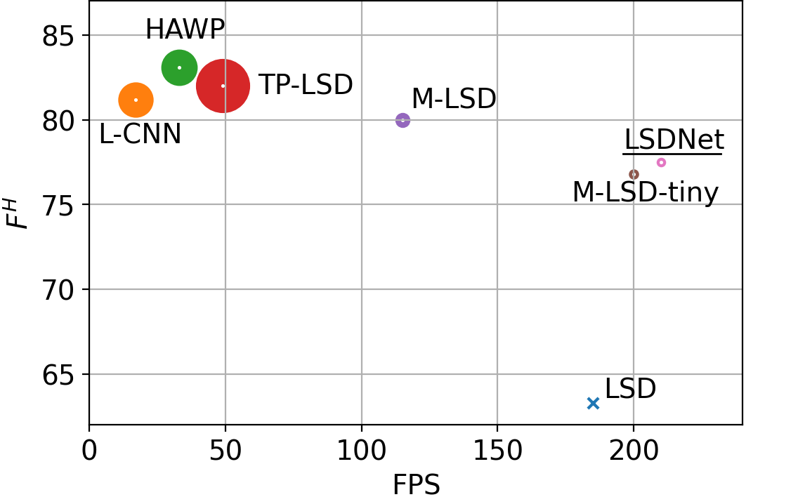

# LSDNet: Trainable Modification of LSD Algorithm for Real-Time Line Segment Detection
Official implementation of "LSDNet: Trainable Modification of LSD Algorithm for Real-Time Line Segment Detection." by Teplyakov, Lev, Leonid Erlygin, and Evgeny Shvets. IEEE Access 10 (2022): 45256-45265.

links to the paper: [IEEE Access](https://ieeexplore.ieee.org/abstract/document/9761231), [arXiv.org](https://arxiv.org/abs/2209.04642)

## Quantitative Results




## Qualitative Results
Video demo


Images from Wireframe dataset of varying number of salient line segments


LSD detector


HAWP detector


M-LSD-tidy detector


LSDNet, the proposed detector


## Setting up LSDNet Project
WARNING: all the scripts run in docker container without GPU support.
We preferred plug-and-play demo with low FPS to top performance with hardcore NVIDIA-docker installation.

### Installation
```bash
cd devops
sh build_image.sh
```
it takes about 10 min, it will download all the requirements and compile OpenCV the way we need it.

### Launch Interactive Demo

The Interactive Demo allows you to play with LSDNet on single images.

To launch the demo server (based on [Gradio](https://gradio.app/)) run
```bash
cd devops
sh launch_web_vis.sh
```
This commad will launch a web server and print its address. The interface should look like this.


### Running on Your Images
To make predictions on your images, specify in `devops/detect_lines.sh` the following variables:
- `input_path` - path to an images folder or a single image (images must be `png` or `jpg`)
- `out_path` - path where predicted segments will be saved in `.txt` format (`x1`,`y1`, `x2`,`y2`,`conf`) - the coordinates of segments' endpoints and segment confidence

As a container mounts to the repo's root directory, paths above must be:
- relative to `lsd/detect_lines.py` file
- inside the repo's directory

Then make predictions on your images with  
```bash
cd devops
sh detect_lines.sh
```
